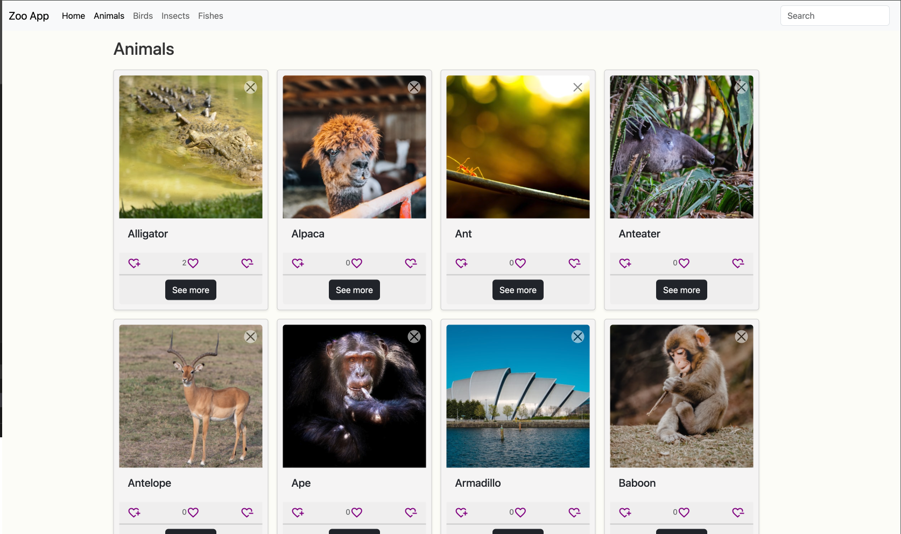

# Zoo App

This repository contains the code for a simple Zoo App built using React and the react-router-dom library. The app allows users to browse through different categories of animals, search for specific animals, and like or remove animals from the list.

## Features

- Browse through different categories of animals (animals, birds, fishes, insects)
- Search for specific animals within a category
- Like an animal to increase its like count
- Remove an animal from the list

## Tech Stack

- React
- React-router-dom
- React Hook
- Bootrap 5.3

## Getting Started

To get a local copy of the project up and running, follow these simple steps:

- Clone the repository:
  ```bash
  git clone https://github.com/your-username/animal-zoo-app.git
  ```
- Navigate to the project directory:
  ```bash
  cd animal-zoo-app
  ```
- Install the dependencies:
  ```bash
  npm install
  ```
- Start the development server:

  ```bash
  npm run dev
  ```

- Open your browser and navigate to http://localhost:5173 to view the app.

## Usage

The app consists of a navigation bar with links to different categories of animals. Clicking on a category will take you to a page displaying all the animals in that category. You can search for a specific animal by typing its name in the search bar. To like an animal, click on the heart icon next to its name. To remove an animal from the list, click on the "Remove" button next to its name.

## Visuals

_Landing Page / Home_


|                                                       |                                                      |
| :---------------------------------------------------: | :--------------------------------------------------: |
|                        Animals                        |                        Birds                         |
|  |   |
|                        Insects                        |                        Fishes                        |
|  |  |

## Contributing

Pull requests are welcome. For major changes, please open an issue first to discuss what you would like to change.

License
This project is licensed under the MIT License.

## Authors

👤 \*Kajol Sutra Dhar\*\*

- GitHub: [@kdev](https://github.com/the-sankari)
